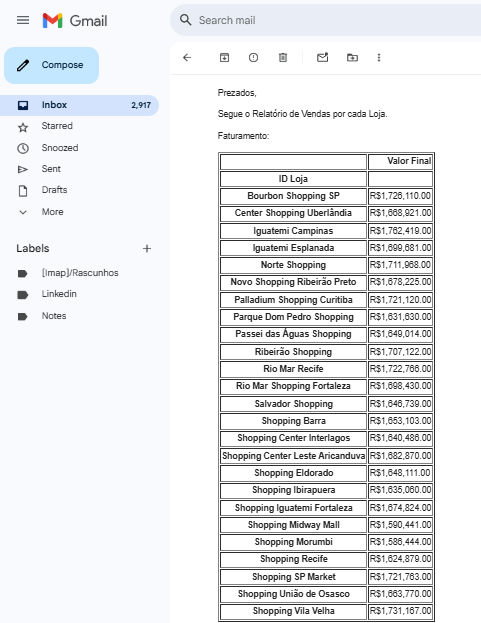

# 📊 Relatório de Vendas por Loja (com envio por e-mail)

Este projeto realiza a automação de um relatório de vendas com base em uma planilha Excel, processa os dados por loja e envia os resultados por e-mail de forma automática utilizando o Outlook.

## ✅ Funcionalidades

- Leitura de dados a partir de uma planilha `.xlsx`.
- Cálculo de:
  - Faturamento por loja.
  - Quantidade de produtos vendidos por loja.
  - Ticket médio por loja.
- Envio automático de e-mail com relatório formatado em HTML.

## 🛠️ Tecnologias utilizadas

- Python 3
- `pandas` — para manipulação dos dados.
- `openpyxl` — para leitura de arquivos Excel.
- `pywin32` (`win32com`) — para integração com o Outlook e envio de e-mail.

## 🚀 Como usar

1. Clone o repositório:
   ```bash
   git clone https://github.com/c4rl0sfilho/RelatorioDeVendas.git
   ```

2. Acesse a pasta do projeto:
   ```bash
   cd relatorio-vendas
   ```

3. Crie e ative o ambiente virtual (opcional, mas recomendado):
   ```bash
   python -m venv venv
   .\venv\Scripts\activate  # Windows
   source venv/bin/activate  # Mac/Linux
   ```

4. Instale as dependências:
   ```bash
   pip install pandas openpyxl pywin32
   ```

5. Substitua o conteúdo de `Vendas.xlsx` pelo seu arquivo de vendas.

6. No código, atualize o e-mail do destinatário:

   ```python
   destinatario = 'seuemail@exemplo.com'
   ```

7. Execute o script:
   ```bash
   python main.py
   ```

8. O relatório será enviado automaticamente via Outlook.

## 📌 Observações

- É necessário ter o **Microsoft Outlook instalado e configurado** na máquina para o envio automático de e-mails funcionar corretamente.
- As tabelas são enviadas com formatação HTML diretamente no corpo do e-mail.

## 📽️ Exemplo do resultado

<p align="center">
  
</p>

## 📚 Créditos

Este projeto foi desenvolvido com base em conteúdos do canal [Hashtag Programação](https://www.youtube.com/@hashtagprogramacao).
